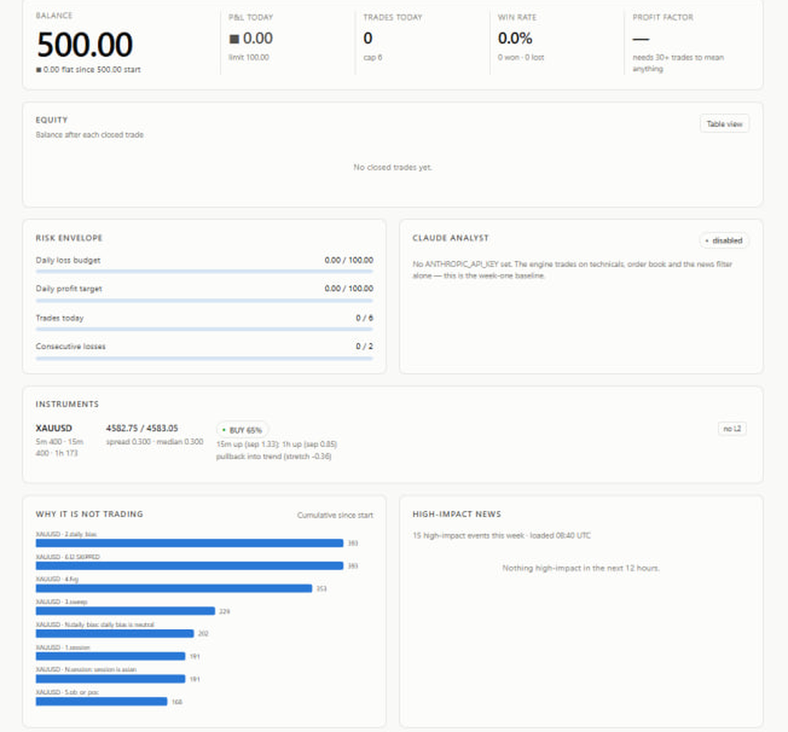

# cme-orderflow-engine

An intraday research engine for CME gold futures: a market-data layer, an
order-flow feature extractor, and the measurement tooling that decides whether
anything it produces is real.

> ### What is in this repository
>
> This is the **infrastructure layer** of a live research project, published for
> review. It is **not a runnable trading system**, and it is not open source —
> see [LICENSE](LICENSE).
>
> | Module | What it is |
> |---|---|
> | [`core/scid_reader.py`](core/scid_reader.py) | Decoder for Sierra Chart's binary `.scid` intraday files |
> | [`core/bitstamp_client.py`](core/bitstamp_client.py) | A second venue behind the same client interface, with book reconciliation |
> | [`core/book_ids.py`](core/book_ids.py) | Price-keyed depth deltas translated to id-keyed quotes |
> | [`core/dtc_client.py`](core/dtc_client.py) | Full DTC protocol interface spec — message types, data shapes, threading contract |
> | [`core/symbols.py`](core/symbols.py) | Futures contract maths: multipliers, tick grids, whole-contract sizing |
> | [`core/risk.py`](core/risk.py) | Risk manager and circuit breakers. Every gate can only refuse a trade |
> | [`core/marketdata.py`](core/marketdata.py) | Tick → multi-timeframe bar aggregation, incremental L2 book |
> | [`core/broker.py`](core/broker.py) | Pessimistic paper-fill simulator and the gated live-order path |
> | [`triple_barrier.py`](triple_barrier.py) etc. | The measurement tooling described below |
>
> **Withheld** — the `ict/` package: the ICT signal rules, the feature
> extractor and the LightGBM pipeline. Only `core/engine.py` and `run.py`
> import from it, so everything above reads on its own.
>
> That separation is not a convenience for publishing. The strategy layer
> depends on nothing but floats and datetimes, which is what let the data feed
> be swapped from cTrader to Sierra Chart to Bitstamp without touching a line
> of it. Three venues; zero changes above the client.

47 Python files, ~11,800 lines, 46 tests.

---

## The result, stated plainly



*Paper mode, observing. The strategy produced a BUY at 65% confidence with its
reasons; the risk layer refused it. The veto chart is cumulative over the
replay and says which gate stopped each evaluation — `daily_bias` first, on
every single bar.*

The pipeline runs end to end on real XAUUSD tick data — 4,898,251 ticks over
six trading days, decoded from Sierra Chart's own `.scid` file, aggregated to
bars, passed through the feature extractor, labelled, and evaluated with a
purged walk-forward split.

**It found no edge.** That is the finding, and it is reported here rather than
buried, because how a system reaches "no" is the part worth reviewing.

### Gold behaved like a coin

Each bar was labelled by what the trade would actually have done: does the
6.50 target get hit before the 4.30 stop, within four hours, with the spread
paid on both crossings?

| | value |
|---|---|
| observed win rate, long / short | 37.4% / 38.0% |
| a fair coin at these distances, spread included | **37.0%** |
| break-even win rate at 1.51 R:R | 39.8% |
| taking every long / every short | PF 0.90 / 0.93, about one spread per trade |
| the model, purged walk-forward | PF 0.96, 38.5% directional |

The observed rate lands on the fair-coin rate. Over these six days, at this
stop and target, gold was indistinguishable from a coin flip and the spread
accounted for the entire gap to break-even. The model selected marginally
better than trading everything and still lost money.

`ict/train.py` refuses to certify a model below its bar and writes
`has_edge=False` into the checkpoint, so a model that does not work cannot be
mistaken for one that does.

### A finding that did not survive

A single-feature scan found one candidate that beat a permutation null taken
over all features and buckets: shorting when the Asian range was narrow,
+1.02 per trade against a shuffled bar of +0.93.

Broken down by day, one session carried 91% of it. Remove that Thursday and
the effect is +0.14 — well inside noise.

The permutation test rules out *luck of many features*. It cannot rule out
*luck of one week*, and only the per-day decomposition shows that. Both checks
are in this repository because the first one alone would have produced a
confident, statistically supported, wrong claim.

---

## Getting real market data without paying for it

The CME feed costs money this project does not have. Three routes were tried,
and the constraints are as much network as budget:

**Crypto venues.** Kraken, Binance, Coinbase and Bybit all time out during the
TLS handshake from this network — filtering at the SNI level, not a blocked
port. Bitstamp answers. `core/bitstamp_client.py` implements the same
interface `core/dtc_client.py` declares, so everything above the client ran on
live L2 depth without modification. Crypto microstructure is not CME's, so
this validated the engineering and nothing about the edge.

**Sierra Chart's own files.** The decisive one. Sierra Chart writes every tick
it receives into a binary `.scid` file on disk — months of real XAUUSD data
already sitting there, no subscription involved.
[`core/scid_reader.py`](core/scid_reader.py) decodes it: 40-byte records where
`Open == 0.0` marks `SINGLE_TRADE_WITH_BID_ASK` and `High` is the ask, `Low`
the bid. Get that backwards and the book is inverted and every spread-derived
feature with it, which is why the first test in the file is the one that
checks it.

Aggregated records in the downloaded portion carry no quotes at all. Bid and
ask both fall back to the close there and the spread is exactly zero — a real
limitation, documented in the module rather than left for a reader to assume.

---

## The measurement tooling

Most of the work in this project turned out to be deciding what to believe.
Each of these exists because something looked true and was not.

**[`triple_barrier.py`](triple_barrier.py)** — labels a bar by the trade it
describes, not by a price change. A long enters at the ask and exits at the
bid, so the cost sits inside the label rather than beside it as a caveat. Long
and short are computed separately, because after the spread they are not each
other's negative: a bar can lose both ways, and on this instrument that is
common. Ties are scored as losses; assuming the favourable order within a tick
is how a backtest quietly inflates itself. 13 tests.

**[`feature_separation.py`](feature_separation.py)** — scans one feature at a
time against a permutation null taken over *all* features and buckets. Testing
thirty features and reporting the best is not one test; the best of thirty
noise columns looks impressive by construction. The null keeps every feature
and every bucket edge and breaks only the link between a row and its outcome.

**[`inspect_finding.py`](inspect_finding.py)** — decomposes a surviving
finding by day. Two hundred bars drawn from two sessions is closer to two
observations than to two hundred, and no statistic applied to the row count
notices. This is the check that killed the only candidate here.

**[`inspect_features.py`](inspect_features.py)** — flags constant columns and
columns that correlate with row order. Six of the declared features are
constant on this dataset: `box_type`, `daily_bias`, and the four
`l2_imbalance_*`, which have nothing to compute from because a `.scid` file
holds trades and top-of-book quotes, not depth. **Thirty live features, not
thirty-six** — and those four dead columns are the concrete argument for why
the paid feed matters.

**[`inspect_labels.py`](inspect_labels.py)** — puts the label threshold next
to the spread it has to beat, and sweeps the multiplier so choosing one is a
decision with numbers under it.

---

## Bugs worth reading about

Three of these were found by tooling in this repository, and all three would
have produced a plausible, wrong result.

**The collector overwrote its own input.** Output and replay input shared the
`ict_<SYMBOL>_<DATE>.csv` naming, so pointing `--out` at `--source` made the
run clobber the ticks it was reading and then parse its own feature rows back
as quotes — 700,315 bars from a three-hour window. The `--out` help text had
warned about this since the flag was added. A warning in help text is not a
guard; `run.py` now refuses.

**Three of ten session features flickered per tick.** The Asian
sweep-and-return flags were cleared on every re-crossing of the range edge —
exactly where the logic is meant to fire — so price oscillating around the
level re-armed and re-confirmed the trap hundreds of times a session. A
confirmed sweep-and-return is an event, not a state. The fix was deleting two
lines.

**The collector appends.** Correct for a live feed, where a restart continues
the day's file. Never correct for a deterministic replay: a second run into
the same directory writes every row twice, the count doubles — which reads as
more data — and every mean and rate is unchanged, which reads as a stable
result. Nothing looks wrong. Caught at 2,710 rows where the run wrote 1,355.

---

## Layout

```
run.py              check / selftest / collect / status / run
config.py           settings, per-symbol contract specs, secret masking
triple_barrier.py   trade-outcome labels from raw ticks
feature_separation.py   single-feature scan with a permutation null
inspect_finding.py  per-day decomposition of a candidate finding
inspect_features.py dead columns, calendar drift, label balance
inspect_labels.py   label threshold against the spread it must beat
compare_presets.py  compare two collector runs
verify_book.py      order-book reconciliation against a REST snapshot
core/
  scid_reader.py    Sierra Chart .scid  ->  replay tick CSVs
  dtc_client.py     DTC protocol interface spec (no socket code yet)
  bitstamp_client.py  Bitstamp adapter behind the same interface
  book_ids.py       price-keyed depth deltas -> id-keyed quotes
  symbols.py        contract specs, price/size/money conversions
  marketdata.py     ticks, multi-timeframe bars, level-2 book
  indicators.py     EMA / RSI / ATR (pure functions)
  strategy.py       signal generation
  risk.py           position sizing and circuit breakers
  broker.py         PaperBroker (simulated) and LiveBroker (gated)
  journal.py        JSONL event log + CSV trade log
  engine.py         the decision loop
  analyst.py        optional Claude review layer (veto only)
  news.py           economic-calendar blackout
panel/              read-only monitoring dashboard (separate process)
deploy/             hardened systemd units
tests/              46 tests
```

## Install and run

```bash
pip install -r requirements.txt
python -m pytest -q                 # 46 tests, no network, no broker
python run.py selftest              # full pipeline on synthetic data
```

Decode real ticks, replay them, label and evaluate:

```bash
python -m core.scid_reader --file "C:\SierraChart\Data\XAUUSD.scid" \
                           --out data --start 2026-08-20 --end 2026-08-31
python run.py collect --feed dry --research --source data --out features
python triple_barrier.py --ticks data --features features --symbol XAUUSD
python feature_separation.py data/triple_barrier.csv
```

`--out` may not equal `--source`, and neither may point at a directory that
already holds output. Both are refused with an explanation, for the reasons in
*Bugs worth reading about*.

`--feed dtc` is refused by design — neither process may silently fall back to
a broker — and no order can be sent in any mode.

## The four gates before real money

All four are required, and each can only refuse:

1. `EXECUTION_MODE=live` in `.env`
2. `--arm`
3. `--i-understand-live`
4. the word `LIVE` typed at the prompt

Miss any one and fills stay simulated. The DTC order path is not implemented,
so `core/broker.py` refuses every order regardless.

## Known limitations

- **`core/dtc_client.py` has no socket code.** It is an interface blueprint —
  every signature the engine and collector call, documented and typed, with
  empty bodies. Filling them in is the remaining job.
- **Thirty live features, not thirty-six**, on data from a `.scid` file. The
  four `l2_imbalance_*` columns need real depth.
- **The label horizon and the trade design do not yet agree.** The 5-minute
  label in `ict/prepare.py` asks a different question from a 4.30 stop and a
  6.50 target; `triple_barrier.py` is the answer and is not yet the default.
- **`MIN_DIRECTIONAL_ACCURACY` is a constant.** 0.52 was right for the old
  symmetric label. At 1.51 R:R the break-even rate is 39.8%, so the gate
  should derive from the target and stop rather than being pinned.
- Paper fills charge spread and commission but cannot model slippage on a fast
  market or a stop gapping through a level. Live will be worse than paper.
- The engine holds at most one position and does not trail, scale in or hedge.
- One MGC contract at the configured 4.30 stop risks $43. This is a
  paper-trading and data-collection configuration, not a live one.

## Design notes

**Windows import order is load-bearing.** `ict/train.py` imports LightGBM
before pandas. Both ship an OpenMP runtime, and whichever loads second binds
against one already initialised; the first `LGBM_DatasetSetField` then dies
with an access violation that looks exactly like corrupt training data.
`KMP_DUPLICATE_LIB_OK` does not help.

**The panel's colours.** Colour never carries meaning alone. The red/green
profit pair fails colourblind separation — measured at ΔE 4.1 under
deuteranopia against an ≥8 threshold — so every signed value also carries a
sign, an arrow glyph and, in the trades table, the word "win" or "loss". Light
and dark are separately chosen steps of the same palette, not an inverted
flip.

## What this is not

This is a complete, working research system. It is not a profitable strategy,
and nobody can hand you one. The measured result above is the honest state of
it: a pipeline that works, evaluated correctly, reporting no edge on six days
of data — which is the right answer for six days of data.

The next thing that changes it is more of that data, not more model.
